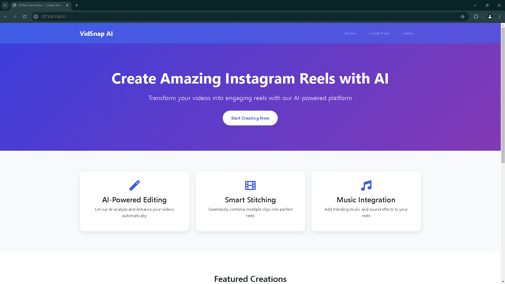

# VidSnap AI

VidSnap AI is a tool that generates short videos from images using AI voice narration and automated video processing.

The system combines text-to-speech narration with image sequences to produce simple video reels.

## Features

- Generate narration using ElevenLabs AI voices
- Convert images into short videos
- Automatically combine audio and images
- Video rendering powered by FFmpeg
- Simple Flask web interface

## Tech Stack

- Python
- Flask
- ElevenLabs API
- FFmpeg
- HTML / CSS

## Project Structure

VidSnap AI Project

app/ – backend logic  
assets/ – images and audio  
templates/ – HTML pages  
static/ – CSS and static files  
outputs/ – generated videos  
requirements.txt – dependencies  
config.py – configuration  
main.py – application entry point  

## Installation

Clone the repository:
git clone https://github.com/aaqil-codes/vidsnap-ai.git
cd vidsnap-ai

## Install dependencies
pip install -r requirements.txt

## Create a `.env` file and add your API key:
ELEVENLABS_API_KEY=your_api_key_here

## Run the Application
python main.py

## Then open in browser
http://127.0.0.1:5000

# VidSnap AI

AI-powered tool that generates short videos from images using ElevenLabs voice narration and FFmpeg automation.
